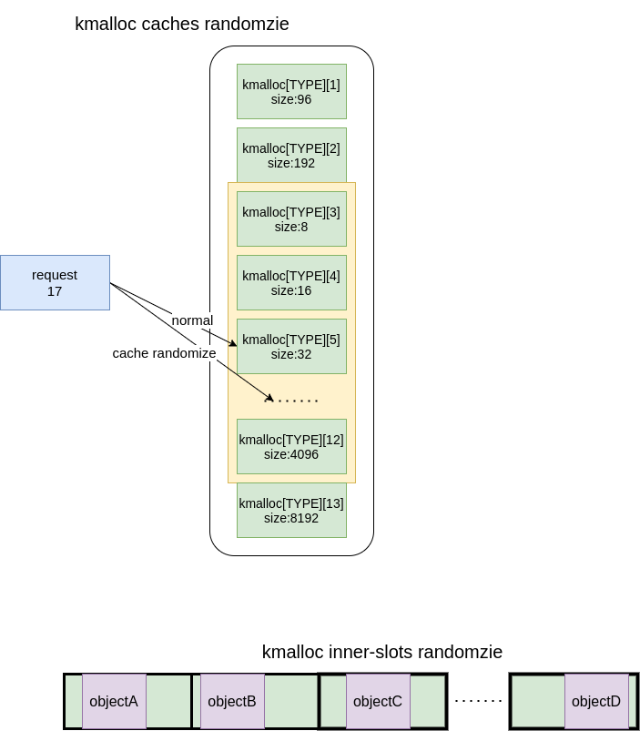

# kmalloc caches randomize and inner-slot randomize against slab attacks


## RATIONALE:

In the previous patch, I quote from the paper 'slake'
> both victim and spray objects are allocated in kmalloc and controlled by clear syscall.

victim and spray objects are necessary for exploiting and quantity is limited, so obscuring these objects may be feasible to hinder the attack.

I leverage randomize to puzzle the slab layout(just replace `kmalloc` with `kmalloc_rand`).

1. **kmalloc cache randomize**: 
there are 13 kmalloc caches for each type, we can select other kmalloc caches whose slot size is larger than requested

2. **inner-slot randomize**: 
slub allocated equal or larger slot for current request to load the object, so take full use of the extra blank space,randomize the position of the object in the slot, and return the randomized address.



after deploying 2 features, attackers neither know which cache to spray, nor the accurate offset from the pointers in the slot(or between the slots).

No matter OOB, double-free, or UAF.


## details:(and annotations in source code)
1. inner-slot only randomize caches whose slot size is the power of 2,because slub de-randomize randomized objects' addresses by aligning the slot size, caches slot size  192 or 96 are hard to align.
2. allocated by `kmalloc_rand`,  free by `kfree` same as other objects.
3. the inner-slot randomize must be 8 bytes alignment, otherwise 'ALIGN CHECK' trap will be triggered
4. cache randomize and inner-slot randomize are separate features, enable one of them would also help.

## drawbacks:
1. waste of memory
2. cannot randomize cache which size is 4K

## TODO:
1. do some static analysis about victim and spray objects,find them and test the randomize feature
2. test KASAN with randomizing feature.


## Appendix: (statistic of extra space in slots)

```
sudo bpftrace -e 'tracepoint:kmem:kmalloc { @[args->bytes_alloc-args->bytes_req] = count();
  @padding=hist(args->bytes_alloc-args->bytes_req); }'

@padding: 
[0]               173774 |@@@@@@@@@@@                                         |
[1]               103149 |@@@@@@                                              |
[2, 4)             89517 |@@@@@@                                              |
[4, 8)            242056 |@@@@@@@@@@@@@@@@                                    |
[8, 16)           768225 |@@@@@@@@@@@@@@@@@@@@@@@@@@@@@@@@@@@@@@@@@@@@@@@@@@@@|
[16, 32)          649336 |@@@@@@@@@@@@@@@@@@@@@@@@@@@@@@@@@@@@@@@@@@@         |
[32, 64)           12109 |                                                    |
[64, 128)          11286 |                                                    |
[128, 256)          7576 |                                                    |
[256, 512)          9425 |                                                    |
[512, 1K)           6569 |                                                    |
[1K, 2K)            7271 |                                                    |
[2K, 4K)               5 |                                                    |
[4K, 8K)               1 |                                                    |
```